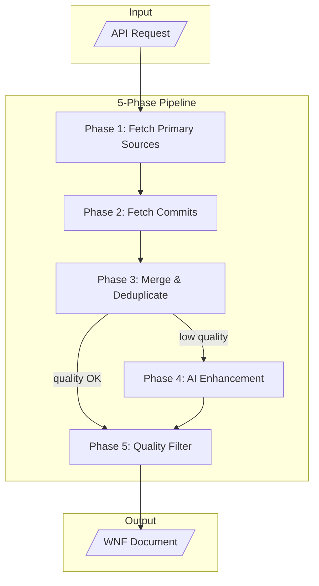

# WNF Data Flow Architecture

This document explains how WNF (What's New Format) documents are generated using multi-source aggregation and optional AI enhancement.

## Overview

WNF uses a **multi-source augmentation strategy** (not just fallback) to maximize coverage. The system always tries to merge data from multiple sources to provide the most complete picture.



## Data Sources

### 1. GitHub Release (Primary)
The preferred source. GitHub Releases often contain curated, human-written release notes.

**Formats detected:**
- **Changesets** - Structured with Major/Minor/Patch sections
- **Keep-a-Changelog** - Sections like Added, Changed, Fixed, Removed
- **Conventional Commits** - Commit-style entries (feat:, fix:, chore:)
- **GitHub Auto-generated** - PR list with "What's Changed" section

### 2. CHANGELOG.md (Secondary)
If GitHub Release has insufficient content, we search for changelog files:
- `CHANGELOG.md`, `CHANGELOG`, `HISTORY.md`, `CHANGES.md`
- Package-specific paths for monorepos

### 3. Commit History (Always Augmented)
Unlike pure fallback systems, commits are **always fetched** to catch undocumented changes:
- Parse conventional commit messages
- Group by type (feat, fix, chore, etc.)
- Extract PR/issue references

---

## Pipeline Phases

### Phase 1: Fetch Primary Sources
```
GitHub Release → Parse with format detection
CHANGELOG.md   → Parse with Keep-a-Changelog parser
```

### Phase 2: Fetch Commits (Always)
```
Get commits between tags → Parse conventional commits
```
This runs regardless of Phase 1 quality to ensure nothing is missed.

### Phase 3: Merge & Deduplicate
```
Combine all sources → Match by PR/issue refs → Remove duplicates
```

### Phase 4: AI Enhancement (Optional)
Triggers when `QualityAssessor` detects low-quality results:

| Trigger | Condition |
|---------|-----------|
| Low Confidence | `confidence < 0.6` |
| All "Other" | 100% items in "other" category |
| High "Other" Ratio | > 80% in "other" |
| Empty Categories | 0 items but content > 150 chars |
| Missing Expected | Has commits but no categories extracted |

### Phase 5: Quality Filter
Apply minimum confidence thresholds per source before final output.

---

## Confidence Scoring

### By Source
| Source | Confidence Range |
|--------|-----------------|
| GitHub Release | 0.5 - 0.9 (depends on format) |
| CHANGELOG.md | 0.85 |
| Commit History | 0.6 - 0.75 |

### By Format
| Format | Confidence |
|--------|------------|
| Keep-a-Changelog | 0.9 |
| Changesets | 0.85 |
| Conventional Commits | 0.7 |
| GitHub Auto-generated | 0.5 |

---

## AI Enhancement

Uses **grounded generation** to prevent hallucinations:

1. **Extract Anchors** - Find all PR/issue refs in original text
2. **AI Categorization** - Model categorizes using extracted refs only
3. **Validate Refs** - Only accept items with valid original references
4. **Merge Results** - Combine AI output with grounded anchors

**Implementation**: Uses Vercel AI SDK with Anthropic (Claude Haiku) or OpenAI (GPT-4o-mini).

---

## Category Inference

Items are categorized using a **4-tier inference system**:

```
1. Explicit Breaking Markers (highest priority)
   BREAKING CHANGE:, !: suffix

2. Conventional Commit Type
   feat: → features, fix: → fixes

3. Keyword Analysis
   "add", "new" → features
   "fix", "resolve" → fixes

4. Section Header Fallback (lowest priority)
   Use original section if no better match
```

---

## Code Entry Points

### ReleaseService
```typescript
// packages/core/src/services/release.service.ts
getLatestReleaseWNF(owner, repo, options?)
getReleaseByTagWNF(owner, repo, tag, options?)
getReleasesInRange(owner, repo, options)
```

### DataAggregator
```typescript
// packages/core/src/aggregator/data-aggregator.ts
aggregate(owner, repo, tag, options?)
```

### Format Detection
```typescript
// packages/parsers/src/format-detector.ts
detectFormat(body): { format, confidence }
```

### Category Inference
```typescript
// packages/parsers/src/categorizer/inference.ts
inferItemCategory(text, sourceHint?): CategoryId
```

---

## Configuration

### ReleaseService Options
```typescript
const service = new ReleaseService({
  token: process.env.GITHUB_TOKEN,
  ai: {
    enabled: true,
    provider: 'anthropic',  // or 'openai'
    model: 'claude-3-haiku-20240307',
  }
});
```

---

## See Also

- [Multi-Source Strategy](./multi-source-strategy.md) - Detailed source logic
- [WNF Specification](../wnf-specification.md) - JSON schema
- [Implementation Roadmap](../implementation-roadmap.md) - Development phases
